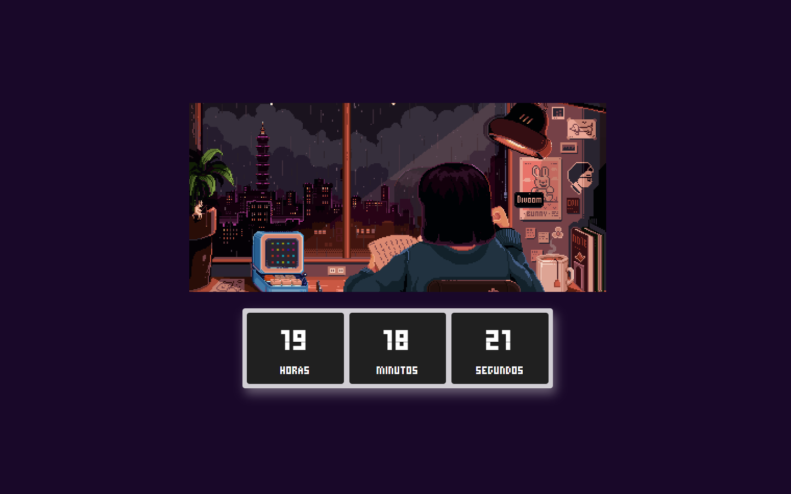

# ⏰Relógio - PWA

Uma simples aplicação de relógio digital desenvolvida com HTML, CSS e JavaScript. A aplicação está configurada como um Progressive Web App (PWA), permitindo que os usuários a instalem diretamente em seus dispositivos e a utilizem mesmo offline.

## ✨ Funcionalidades

⏱️ Relógio em tempo real: Exibe as horas, minutos e segundos atualizados a cada segundo.

📦 PWA: Pode ser instalada no dispositivo e utilizada offline, com o cache dos principais arquivos.

## 🛠️ Tecnologias Utilizadas

- HTML: Estrutura da aplicação.

- CSS: Estilização da interface, com foco em um design simples e responsivo.

- JavaScript: Controle da lógica de funcionamento do relógio e atualização em tempo real.

- PWA (Progressive Web App): Configuração para instalação e funcionamento offline usando Service Workers.